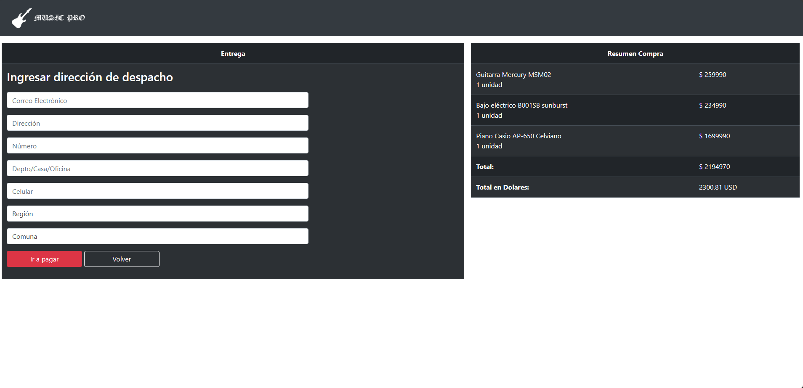

# MusicPro 🎵

MusicPro es una página web en la que puedes comprar instrumentos, agregarlos al carrito y ver el valor total en dolares. 
También contiene las vistas de bodeguero, contador y vendedor.

## Importante 💻

Se requiere la instalación de librerías para utilizar el proyecto. 
Estas son: 
-pip install djangorestframework 
-pip install requests 
-pip install Pillow 

## Imagenes del proyecto 📷

Inicio 

Inicio de Sesión 

Registro 

Tienda 

Carrito 

Envío 

Pago 

